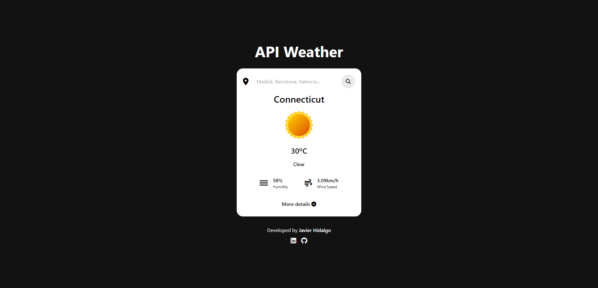
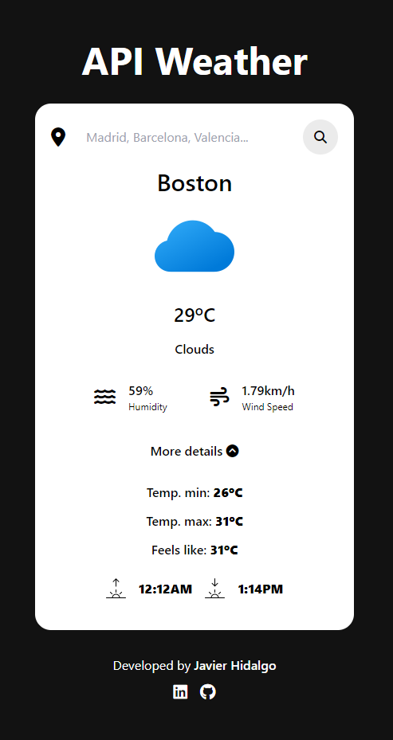
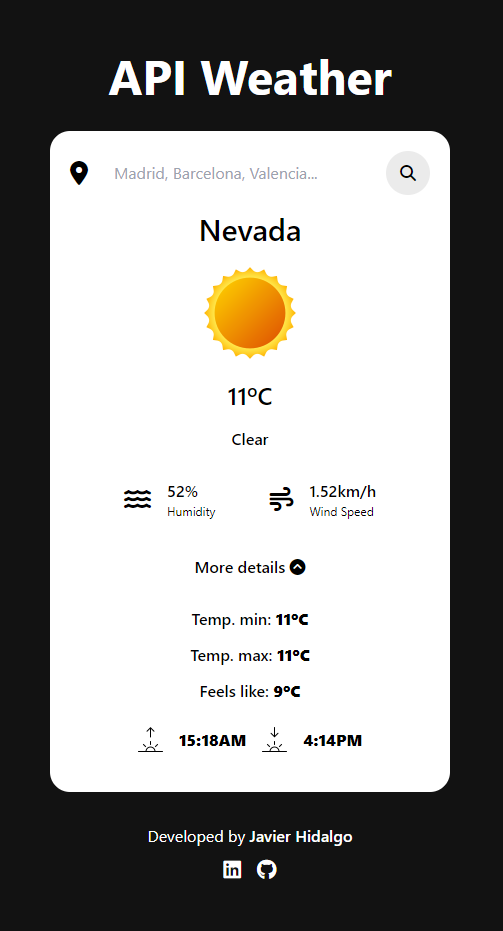

# Weather APP

Consulta el tiempo de cualquier parte del mundo, de forma sencilla y rápida.

## Características

- Datos del tiempo de cualquier parte del mundo.
- Recupera con un solo click el clima, la temperatura, humedad y velocidad del viento.
- También puedes acceder a datos más específicos como las temperaturas mínima y máxima, la sensación térmica, y la salida y puesta del sol.

## Objetivos

- Aprender la tecnología **Tailwind** para la construcción de interfaces de usuario.
- Desarrollo de una aplicación con consulta de datos (*fetching*) a la API de [OpenWeather](https://openweathermap.org/).

## Tecnologías Utilizadas

- JavaScript
- Tailwind

## Captura de Pantalla

## Contribución

Si encuentras errores o deseas agregar nuevas características, siéntete libre de abrir un Issue o enviar un Pull Request.
